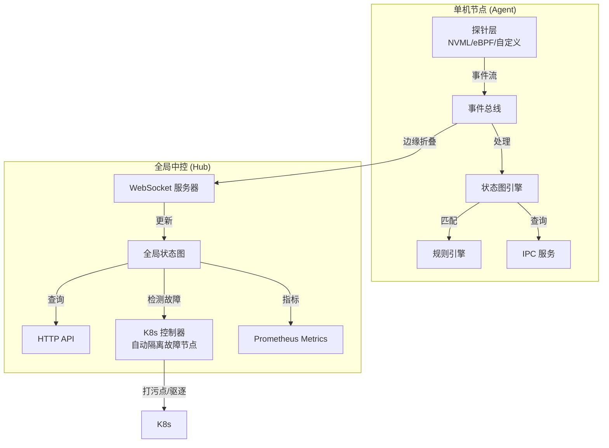
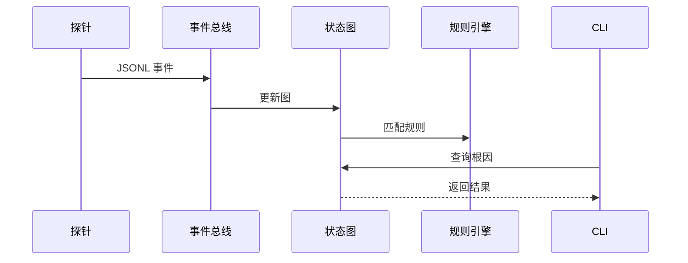
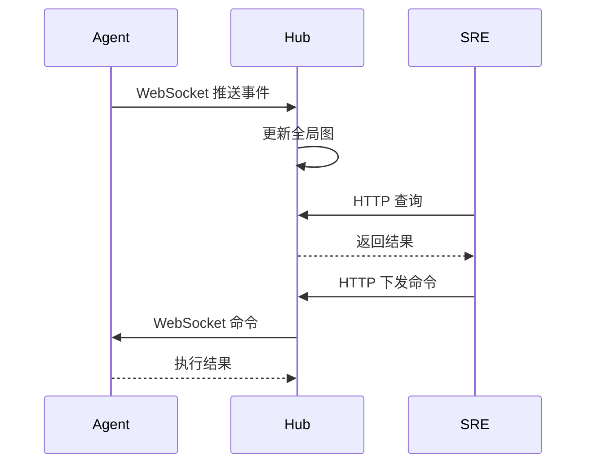

# Ark 🚢 - The Autonomous "Ark" for AI Infrastructure

**守护 AI 算力集群的自愈方舟**

[](https://www.rust-lang.org/)
[](LICENSE)

**Ark** (formerly xctl) is a high-performance, expert-driven control plane built with Rust and eBPF. It monitors heterogenous AI clusters (NVIDIA/Ascend), performs real-time causal graph reasoning, and automatically heals workloads before human SREs even notice the failure.

**Ark** 是一个用 Rust 和 eBPF 打造的高性能、专家驱动的控制面。它监控异构 AI 集群（NVIDIA/昇腾），执行实时因果图推理，并在人类运维感知到故障前自动完成自愈。

## ✨ 特性

- 🚀 **事件驱动内核**：基于事件流的实时状态图，零轮询开销
- 🔌 **可插拔探针**：支持 GPU（NVML）、网络（eBPF/proc）、存储等多种探针
- 🧠 **AI 诊断**：集成大模型（OpenAI/Claude），自动生成修复建议
- 🔍 **因果分析**：自动推导进程-资源-错误的因果关系
- 💻 **极简 CLI**：类似 Docker 的 C/S 架构，轻量级客户端
- 🛡️ **生产级**：内存安全、错误处理完善、OOM 防护
- ☸️ **Kubernetes 原生**：DaemonSet + Deployment，一键部署到万卡集群
- 🤖 **自动驾驶控制面**：自动检测硬件故障，打污点、驱逐 Pod，与 K8s 调度器深度集成
- 📊 **Prometheus 集成**：暴露标准 Metrics 端点，无缝融入 Grafana 监控体系
- 📝 **审计日志**：完整记录所有系统干预动作，满足企业合规要求

## 🚀 快速开始

```bash
# 1. 克隆仓库
git clone https://github.com/osen7/ark-infra.git
cd ark-infra

# 2. 构建项目
cargo build --release

# 3. 启动守护进程（使用 GPU 探针）
cargo run -p ark --release -- run --probe examples/ark-probe-nvml.py

# 4. 在另一个终端查询
cargo run -p ark --release -- ps
cargo run -p ark --release -- why <PID>
cargo run -p ark --release -- diag <PID>  # AI 诊断
cargo run -p ark --release -- fix <PID> --audit-log /var/log/ark/audit.log  # 修复并记录审计日志

# 查看 Prometheus Metrics（Agent 端）
curl http://localhost:9091/metrics
```

详细使用指南请查看 [README_USAGE.md](README_USAGE.md) 和 [QUICKSTART.md](QUICKSTART.md)。

### 🌐 集群模式（Hub + Agent）

```bash
# 终端 1: 启动 Hub（启用 K8s 控制器）
cargo run -p ark-hub --release -- --enable-k8s-controller

# 终端 2: 启动 Agent 并连接到 Hub
cargo run -p ark --release -- run --hub-url ws://localhost:8080

# 终端 3: 集群级查询和修复
cargo run -p ark --release -- cluster ps --hub http://localhost:8081
cargo run -p ark --release -- cluster why job-1234 --hub http://localhost:8081
cargo run -p ark --release -- cluster fix job-1234 --hub http://localhost:8081
```

### ☸️ Kubernetes 部署（生产环境推荐）

```bash
# 一键部署到 Kubernetes 集群（包含 RBAC 配置）
kubectl apply -k deploy/

# 查看部署状态
kubectl get pods -n ark-system
kubectl get deployment -n ark-system ark-hub
kubectl get daemonset -n ark-system ark-agent

# 查看 Hub 的 Prometheus Metrics
kubectl port-forward -n ark-system svc/ark-hub 8081:8081
curl http://localhost:8081/metrics

# 验证 RBAC 配置
kubectl get clusterrole ark-hub-controller
kubectl get clusterrolebinding ark-hub-controller-binding
```

**重要**: Hub 默认启用 K8s 控制器，会自动检测硬件故障并隔离节点。详细部署指南请查看 [deploy/README.md](deploy/README.md)。

## 📖 文档

- [使用指南](README_USAGE.md) - 完整的功能说明和使用示例
- [快速开始](QUICKSTART.md) - 5 分钟上手指南
- [架构设计](docs/ARCHITECTURE.md) - 系统架构和数据流转详解
- [Kubernetes 部署](deploy/README.md) - 生产级 K8s 部署指南
- [项目路线图](docs/ROADMAP.md) - 开发计划和里程碑
- [规则引擎](docs/RULES_ENGINE.md) - 声明式规则系统
- [eBPF 网络探针](docs/EBPF_NETWORK_PROBE.md) - 内核级网络监控
- [eBPF CO-RE 实现](ark-probe-ebpf/CO-RE_IMPLEMENTATION.md) - CO-RE 四元组提取指南
- [Kubernetes 部署](deploy/README.md) - 生产级 K8s 部署指南（含 RBAC 配置）
- [探针开发](examples/README.md) - 如何开发自定义探针

## 🏗️ 架构设计

### 系统架构



详细架构说明请查看 [架构设计文档](docs/ARCHITECTURE.md)

### 核心原则

- **事件引擎为核心**：所有底层信号转化为追加写入的事件流
- **KISS 原则**：单机可运行，拒绝过度设计
- **探针彻底解耦**：核心不包含硬件 SDK，探针通过 stdout 输出 JSONL
- **内存极其克制**：使用 Ring Buffer 和无锁通道处理高频事件

### 数据流转

#### 单机模式



#### 集群模式



详细数据流转请查看 [架构设计文档](docs/ARCHITECTURE.md)

### 数据模型

- **8 大原子事件**：计算、传输、存储、进程、错误、拓扑、意图、动作
- **3 大推导边**：Consumes（消耗）、WaitsOn（等待）、BlockedBy（阻塞）


## 📦 项目结构

```
x-infra/
├── core/                # 共享底座（事件系统、状态图、规则引擎）
│   └── src/
│       ├── event.rs
│       ├── graph.rs
│       └── rules/       # 规则引擎实现（代码）
├── agent/               # 单机节点程序（ark CLI）
│   └── src/
│       ├── main.rs      # CLI 入口
│       ├── ipc.rs       # IPC 服务（Unix Domain Socket / TCP）
│       ├── diag.rs      # AI 诊断模块
│       ├── plugin/      # 探针系统
│       ├── exec/        # 执行引擎
│       └── scene/       # 场景分析器
├── hub/                 # 全局中控（ark-hub）
│   └── src/
│       ├── main.rs      # Hub 主程序
│       ├── metrics.rs   # Prometheus Metrics
│       └── k8s_controller.rs  # K8s 控制器（自动隔离故障节点）
├── ark-probe-ebpf/      # eBPF 网络探针（Rust Aya 框架）
│   ├── ark-probe-ebpf/          # 用户态程序
│   └── ark-probe-ebpf-ebpf/     # 内核态 eBPF 程序
├── rules/               # YAML 规则文件（配置数据）
│   ├── workload-stalled.yaml
│   ├── gpu-oom.yaml
│   ├── network-stall.yaml
│   └── ...              # 其他规则文件
├── examples/
│   ├── ark-probe-nvml.py       # NVIDIA GPU 探针
│   ├── ark-probe-network.py    # 网络探针
│   └── ark-probe-dummy.py      # 模拟探针
└── docs/                # 文档
```

详细架构说明请查看 [docs/WORKSPACE_ARCHITECTURE.md](docs/WORKSPACE_ARCHITECTURE.md)

## 🔧 开发

### 前置要求

- Rust 1.70+
- Python 3.7+（用于探针脚本）
- Linux（网络探针需要 `/proc/net`）

### 构建

```bash
# 构建所有项目
cargo build --workspace --release

# 或构建单个项目
cargo build -p ark --release        # agent
cargo build -p ark-hub --release   # hub
cargo build -p ark-core --release  # core
```

### 测试

```bash
# 运行内置探针测试
cargo run -p ark --release -- run

# 测试 GPU 探针（需要 NVIDIA GPU）
pip install pynvml
cargo run -p ark --release -- run --probe examples/ark-probe-nvml.py
```

## 🤝 贡献

欢迎提交 Issue 和 Pull Request！

## 📄 许可证

MIT License

## 🙏 致谢

本项目遵循极简主义设计哲学，致力于为 AI 基础设施提供轻量、高效的监控和诊断能力。

## 📊 核心数据模型

### 8 大原子事件

- **计算域**: `compute.util` (算力利用率), `compute.mem` (显存/内存使用率)
- **传输域**: `transport.bw` (网络吞吐), `transport.drop` (丢包/重传)
- **存储域**: `storage.iops` (存储 IO), `storage.qdepth` (队列深度)
- **进程域**: `process.state` (进程状态)
- **错误域**: `error.hw` (硬件级报错), `error.net` (网络阻塞报错)
- **拓扑域**: `topo.link_down` (NVLink/PCIe 降级)
- **意图域**: `intent.run` (调度器元数据)
- **动作域**: `action.exec` (系统干预动作)

### 3 大推导边

在状态图中，事件转化为 DAG（有向无环图），边只有三种：

1. **Consumes** (消耗)：进程 PID 消耗某物理资源
2. **WaitsOn** (等待)：进程 PID 正在等待某网络/存储资源完成
3. **BlockedBy** (阻塞于)：资源/进程被某个 Error 彻底阻塞（根因）

## 🔗 相关链接

- [GitHub 仓库](https://github.com/osen7/ark-infra)
- [问题反馈](https://github.com/osen7/ark-infra/issues)
- [功能建议](https://github.com/osen7/ark-infra/issues/new)