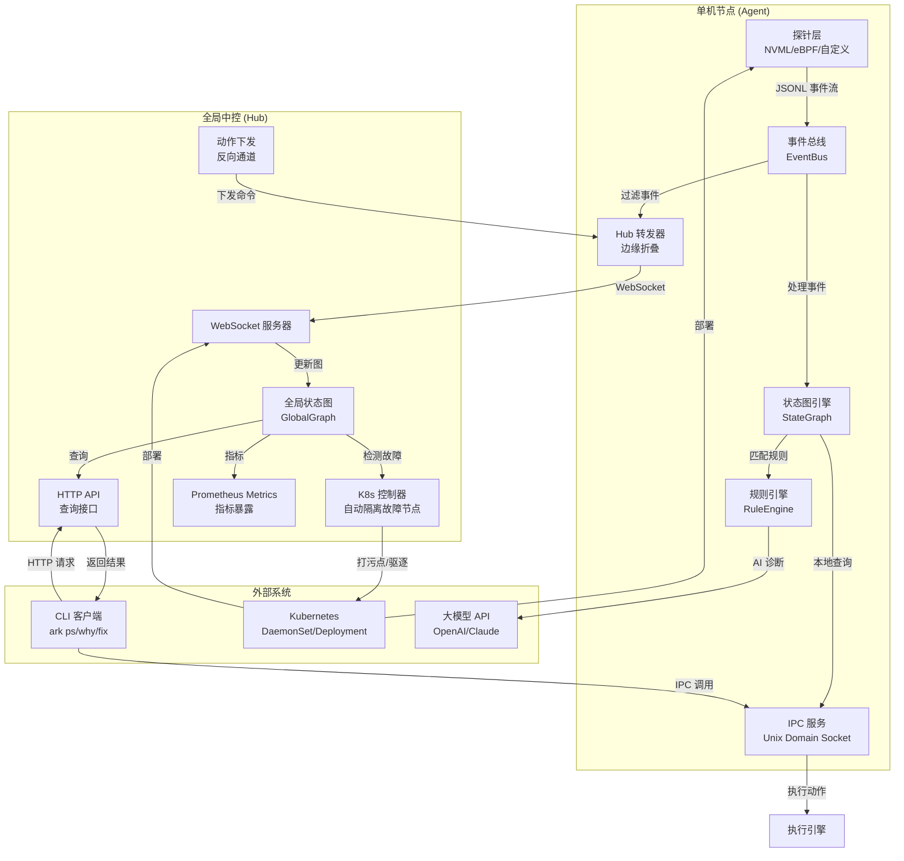
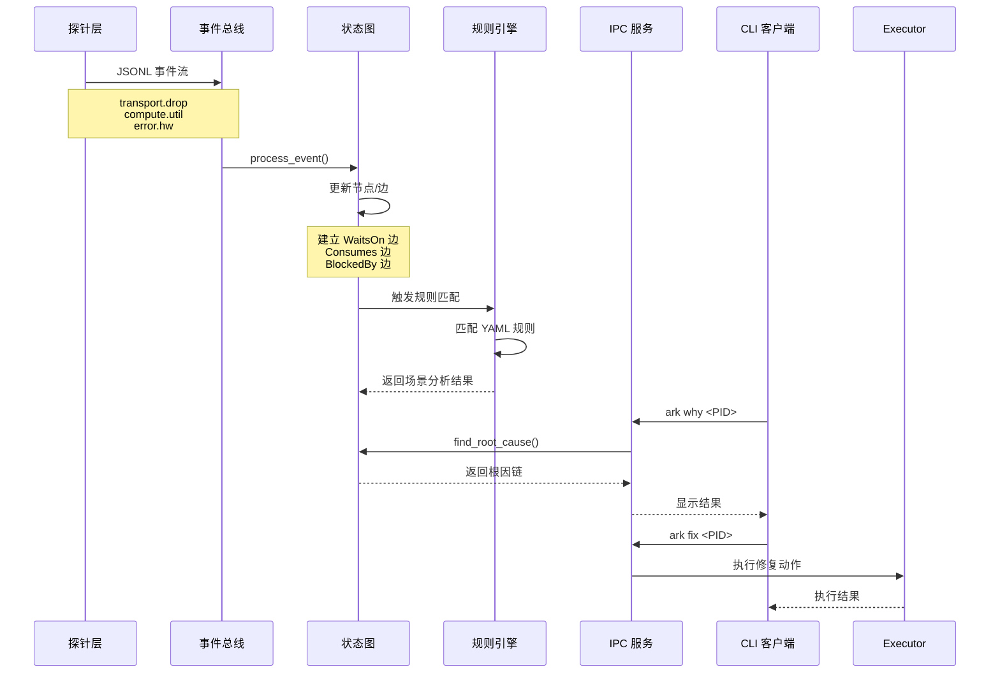
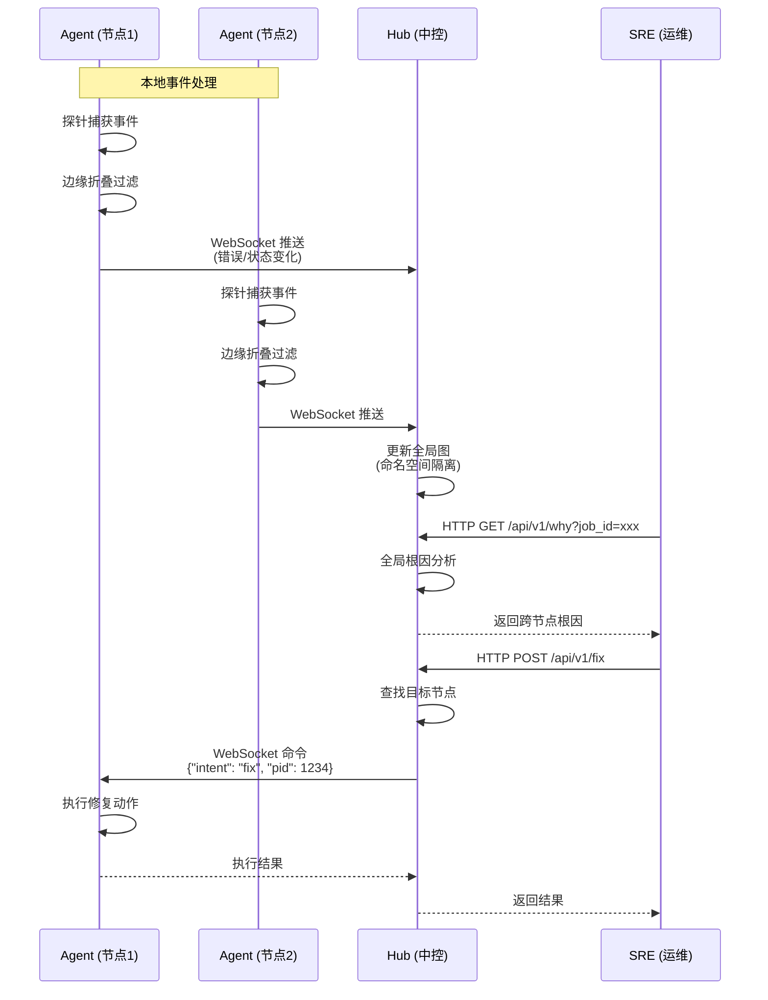
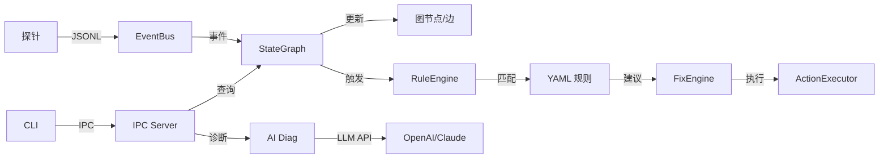
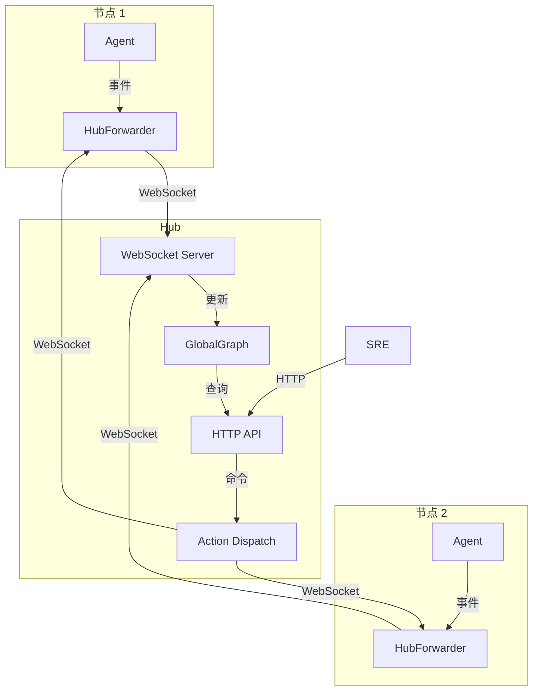

# Ark 架构设计文档

本文档详细描述 Ark 的系统架构、数据流转和核心组件。

## 📐 系统架构总览



## 🔄 数据流转图

### 单机模式数据流



### 集群模式数据流



## 🧩 核心组件详解

### 1. 事件系统 (Event System)

**位置**: `core/src/event.rs`

**职责**:
- 定义 8 大原子事件类型
- 提供事件总线（EventBus）实现
- 事件序列化/反序列化

**事件类型**:
```rust
pub enum EventType {
    ComputeUtil,      // 算力利用率
    ComputeMem,       // 显存/内存使用
    TransportBw,      // 网络吞吐
    TransportDrop,    // 网络丢包/重传
    StorageIops,      // 存储 IO
    StorageQDepth,    // 队列深度
    ProcessState,     // 进程状态
    ErrorHw,          // 硬件错误
    ErrorNet,         // 网络错误
    TopoLinkDown,     // 拓扑降级
    IntentRun,        // 调度意图
    ActionExec,       // 执行动作
}
```

### 2. 状态图引擎 (State Graph)

**位置**: `core/src/graph.rs`

**职责**:
- 维护实时因果图（DAG）
- 处理事件并建立边关系
- 提供根因分析（DFS 逆向搜索）

**图结构**:
```rust
pub struct StateGraph {
    nodes: HashMap<String, Node>,  // 节点：进程/资源/错误
    edges: Vec<Edge>,              // 边：Consumes/WaitsOn/BlockedBy
}

pub enum EdgeType {
    Consumes,   // PID -> Resource (消耗)
    WaitsOn,    // PID -> Resource (等待)
    BlockedBy,  // Resource/Process -> Error (阻塞)
}
```

**关键方法**:
- `process_event()`: 处理事件，更新图
- `find_root_cause()`: 逆向 DFS，查找根因
- `get_active_processes()`: 获取活跃进程列表

### 3. 规则引擎 (Rule Engine)

**位置**: `core/src/rules/`

**职责**:
- 加载 YAML 规则文件
- 匹配规则并触发场景分析
- 生成修复建议

**规则格式**:
```yaml
name: WorkloadStalled
description: 工作负载阻塞检测
triggers:
  - event_type: WaitsOn
    condition: edge.to contains "network"
actions:
  - type: GracefulShutdown
    params:
      signal: SIGUSR1
      wait_seconds: 10
```

### 4. 探针系统 (Probe System)

**位置**: `agent/src/plugin/`

**职责**:
- 管理子进程探针
- 解析 JSONL 输出
- 转换为标准事件格式

**探针接口**:
```python
# 探针输出格式（JSONL）
{"ts": 1234567890, "event_type": "compute.util", "entity_id": "gpu-0", "pid": 1234, "value": "85"}
{"ts": 1234567891, "event_type": "transport.drop", "entity_id": "network-eth0", "pid": 1234, "value": "1"}
```

### 5. IPC 服务 (IPC Service)

**位置**: `agent/src/ipc.rs`

**职责**:
- Unix Domain Socket 服务器（Linux）
- TCP Socket 服务器（Windows）
- 处理 CLI 请求

**协议**:
- 请求/响应 JSON 格式
- 支持 `ps`, `why`, `diag`, `fix` 命令

### 6. Hub 服务 (Hub Service)

**位置**: `hub/src/main.rs`

**职责**:
- WebSocket 服务器（接收 Agent 事件）
- HTTP API 服务器（提供查询接口）
- 全局状态图管理
- 动作下发（反向通道）
- Kubernetes 控制器（自动隔离故障节点）
- Prometheus Metrics 暴露

**API 端点**:
- `GET /api/v1/ps`: 查询所有活跃进程
- `GET /api/v1/why?job_id=xxx`: 全局根因分析
- `POST /api/v1/fix`: 下发修复命令
- `GET /metrics`: Prometheus Metrics 端点

### 7. Kubernetes 控制器 (K8s Controller)

**位置**: `hub/src/k8s_controller.rs`

**职责**:
- 检测不可逆硬件故障（持续 XID 错误、RDMA 链路断开等）
- 自动给 Node 打上 NoSchedule 污点
- 使用 Eviction API 优雅驱逐 Pod（尊重 PDB）

**故障类型**:
- `PersistentXidError`: GPU 持续 XID 错误
- `RdmaLinkDown`: RDMA 物理链路断开
- `StorageDeviceFailure`: 存储设备故障
- `OtherHardwareFailure`: 其他不可逆硬件故障

**安全机制**:
- 冷却时间：5 分钟内不重复操作同一节点
- RBAC 权限：最小权限原则，只授予必要的 K8s API 权限
- 优雅驱逐：使用 Eviction API，尊重 PodDisruptionBudget

### 8. Prometheus Metrics

**位置**: `agent/src/metrics.rs`, `hub/src/metrics.rs`

**职责**:
- 暴露标准 Prometheus 格式指标
- 提供基础指标（节点数、边数、事件处理数）
- 提供详细指标（进程资源使用、等待时间、错误计数）

**指标类型**:
- `ark_graph_nodes_total`: 图中节点总数（按类型）
- `ark_graph_edges_total`: 图中边总数（按类型）
- `ark_events_processed_total`: 已处理事件总数（按事件类型）
- `ark_process_resource_usage`: 进程资源使用（带标签）
- `ark_process_wait_time_seconds`: 进程等待时间（直方图）

### 9. 审计日志 (Audit Log)

**位置**: `agent/src/audit.rs`

**职责**:
- 记录所有 `ark fix` 执行的系统级动作
- 支持文件轮转（按大小，默认 100MB）
- JSON 格式日志，满足企业合规要求

**日志字段**:
- `timestamp`: 时间戳（RFC3339 格式）
- `user`: 执行用户
- `action`: 动作类型
- `target_pid`: 目标进程 PID
- `target_job_id`: 目标任务 ID（可选）
- `result`: 执行结果（success/partial_failure）
- `details`: 详细信息

## 🔗 组件交互图

### 单机模式交互



### 集群模式交互



## 📊 数据模型

### 事件模型

```rust
pub struct Event {
    pub ts: u64,                    // 时间戳（毫秒）
    pub event_type: EventType,       // 事件类型
    pub entity_id: String,           // 资源 ID (如 "gpu-0", "network-eth0")
    pub job_id: Option<String>,      // 任务 ID
    pub pid: Option<u32>,            // 进程 PID
    pub value: String,               // 事件值
    pub node_id: Option<String>,     // 节点 ID (集群模式)
}
```

### 图模型

```rust
pub struct Node {
    pub id: String,                  // 节点 ID (如 "pid-1234", "gpu-0")
    pub node_type: NodeType,         // 节点类型
    pub metadata: HashMap<String, String>,  // 元数据
    pub last_update: u64,            // 最后更新时间
}

pub struct Edge {
    pub from: String,                // 源节点 ID
    pub to: String,                  // 目标节点 ID
    pub edge_type: EdgeType,         // 边类型
    pub ts: u64,                     // 事件时间戳
}
```

## 🚀 部署架构

### Kubernetes 部署

```mermaid
graph TB
    subgraph "Kubernetes 集群"
        subgraph "节点 1"
            DS1[Agent DaemonSet<br/>hostPID/hostNetwork]
        end
        
        subgraph "节点 2"
            DS2[Agent DaemonSet]
        end
        
        subgraph "控制平面"
            DP[Hub Deployment<br/>非特权模式]
            SVC[Hub Service<br/>ClusterIP]
        end
    end
    
    DS1 -->|WebSocket| SVC
    DS2 -->|WebSocket| SVC
    SVC --> DP
    DP -->|K8s API| RBAC[RBAC<br/>ClusterRole<br/>ClusterRoleBinding]
    DP -->|打污点/驱逐| K8s[Kubernetes API]
    
    EXT[外部 CLI] -->|HTTP| SVC
    EXT -->|Prometheus| Metrics[/metrics]
```

### 资源隔离

- **Hub**: 非 root 用户，严格资源限制（256Mi-512Mi），使用 `ark-hub-sa` ServiceAccount
- **Agent**: 特权模式，访问宿主机资源（hostPID/hostNetwork）
- **IPC Socket**: 挂载到宿主机 `/var/run/ark`

### RBAC 权限

- **ServiceAccount**: `ark-hub-sa`（在 `ark-system` 命名空间）
- **ClusterRole**: `ark-hub-controller`
  - `nodes`: get, list, patch（打污点）
  - `pods`: get, list, delete（查询和驱逐）
  - `pods/eviction`: create（优雅驱逐，尊重 PDB）
- **ClusterRoleBinding**: 将 ServiceAccount 绑定到 ClusterRole

## 🔐 安全设计

### 权限分离

- **Hub**: 只负责计算和路由，无系统权限
- **Agent**: 需要内核级权限（eBPF），但限制在 DaemonSet 中
- **IPC**: Unix Domain Socket 使用文件系统权限控制

### 网络安全

- **WebSocket**: 集群内部通信（ClusterIP）
- **HTTP API**: 可选 TLS/HTTPS（生产环境推荐）
- **NetworkPolicy**: 可配置网络隔离策略

## 📈 性能特性

### 事件处理

- **零拷贝**: 事件流直接传递，无序列化开销
- **无锁设计**: 使用 `RwLock` 和 `DashMap` 实现高并发
- **边缘折叠**: Agent 只推送关键事件，减少网络开销

### 内存管理

- **Ring Buffer**: eBPF 使用 PerfEventArray 高效传输
- **LRU Map**: Socket 映射使用 LRU 策略，自动清理
- **资源限制**: 所有组件都有严格的内存限制

## 🎯 扩展点

### 探针扩展

- 实现标准 JSONL 输出格式
- 支持 Python/Rust 探针
- 可插拔架构，无需修改核心代码

### 规则扩展

- YAML 声明式规则
- 支持复杂条件匹配
- 可自定义修复动作

### 集成扩展

- ✅ **Prometheus Exporter**：Agent 和 Hub 都暴露 `/metrics` 端点，提供标准 Prometheus 格式指标
- ✅ **K8s 调度器集成**：自动检测不可逆硬件故障，打 NoSchedule 污点，使用 Eviction API 优雅驱逐 Pod
- ✅ **Audit Log**：完整记录所有系统干预动作，支持文件轮转，满足企业合规要求
- 训练框架联动（计划中）

## 📚 相关文档

- [Workspace 架构](WORKSPACE_ARCHITECTURE.md) - 项目结构说明
- [规则引擎](RULES_ENGINE.md) - 规则系统详解
- [eBPF 探针](EBPF_NETWORK_PROBE.md) - 网络探针实现
- [Kubernetes 部署](../deploy/README.md) - 部署指南
